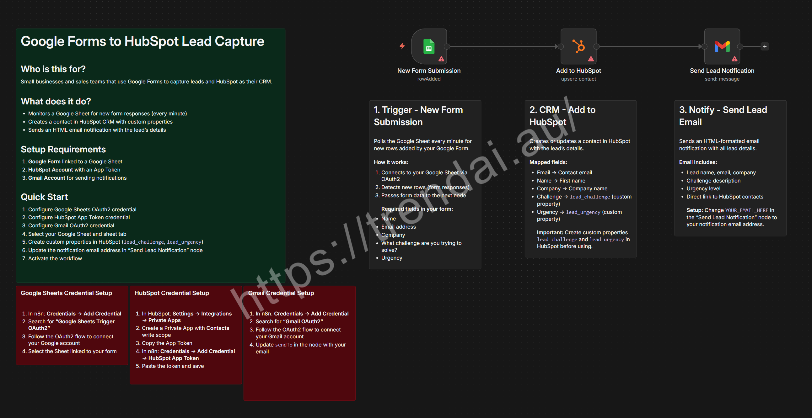

# Google Forms to HubSpot Lead Capture with Email Notification

Automatically captures new lead submissions from a Google Form (via Google Sheets), creates or updates a contact in HubSpot CRM with custom properties, and sends an email notification with the lead's details.

**Import this workflow:**
`https://raw.githubusercontent.com/trendai-au-lab/n8n-workflow/main/workflows/google-forms-hubspot-lead-capture/workflow.json`

## Prerequisites

- Self-hosted n8n instance (v1.113.0+ recommended)
- Google account with access to Google Forms and Sheets
- HubSpot account (free CRM plan works)
- Gmail account for sending notifications

## Credentials

| Node | Credential Type | Purpose |
|------|----------------|---------|
| New Form Submission | Google Sheets OAuth2 | Poll for new form responses |
| Add to HubSpot | HubSpot App Token | Create contacts in CRM |
| Send Lead Notification | Gmail OAuth2 | Send email alerts |

---

## How It Works

1. **Google Sheets Trigger** — Polls the linked Google Sheet every minute for new rows (form responses).
2. **Add to HubSpot** — Creates a new contact in HubSpot using the lead's name, email, company, challenge, and urgency level. Maps form fields to HubSpot custom properties (`lead_challenge`, `lead_urgency`).
3. **Send Lead Notification** — Sends an HTML-formatted email with the lead's details and a direct link to view contacts in HubSpot.

```
Google Form → Google Sheet → n8n Trigger → HubSpot CRM → Email Notification
```

## Key Features

- **Real-time lead capture** — Polls every minute for new form submissions
- **CRM integration** — Automatically creates HubSpot contacts with custom properties
- **Instant notifications** — HTML-formatted email with all lead details
- **Zero manual entry** — Fully automated from form submission to CRM and notification

---

## Setup Guide

### Step 1: Create Your Google Form

1. Go to [Google Forms](https://forms.google.com)
2. Create a new form with these fields:
   - **Name** (Short answer)
   - **Email address** (Short answer, with email validation)
   - **Company** (Short answer)
   - **What challenge are you trying to solve?** (Paragraph)
   - **Urgency** (Multiple choice: Low, Medium, High, Critical)
3. Go to **Responses** tab → click the Google Sheets icon → create a new spreadsheet

### Step 2: Set Up HubSpot

#### Create Custom Properties

1. In HubSpot, go to **Settings** → **Properties**
2. Create two properties:
   - `lead_challenge` — Label: Lead Challenge, Field type: Multi-line text
   - `lead_urgency` — Label: Lead Urgency, Field type: Single-line text (or Dropdown)

#### Create a Private App

1. In HubSpot, go to **Settings** → **Integrations** → **Private Apps**
2. Click **Create a private app**, name it (e.g., `n8n Lead Capture`)
3. Under **Scopes** → **CRM**, enable `crm.objects.contacts.write` and `crm.objects.contacts.read`
4. Click **Create app** and copy the **App Token**

### Step 3: Create n8n Credentials

1. **Google Sheets OAuth2:** Add credential → search "Google Sheets Trigger OAuth2" → follow OAuth2 flow
2. **HubSpot App Token:** Add credential → search "HubSpot App Token" → paste token
3. **Gmail OAuth2:** Add credential → search "Gmail OAuth2" → follow OAuth2 flow

### Step 4: Import & Configure the Workflow

1. In n8n, click **Add Workflow** → **Import from File** → select `workflow.json`
2. **New Form Submission** node: select your Google Sheet and sheet tab (`Form responses 1`)
3. **Add to HubSpot** node: connect your HubSpot credential
4. **Send Lead Notification** node: connect your Gmail credential and change `YOUR_EMAIL_HERE` to your notification email

### Step 5: Activate & Test

1. Click **Save** and toggle the workflow to **Active**
2. Submit a test response in your Google Form
3. Wait up to 1 minute, then verify:
   - A new contact appears in HubSpot with custom properties
   - You receive an email notification with the lead details

---

## Customization

| Option | Node | Details |
|--------|------|---------|
| Polling frequency | New Form Submission | Default: every minute |
| HubSpot properties | Add to HubSpot | Add more custom property mappings under `customPropertiesValues` |
| Email template | Send Lead Notification | Edit the `message` field HTML |
| Form fields | All nodes | Add new form fields, map them in HubSpot, add to email template |

---

## Troubleshooting

| Problem | Solution |
|---------|----------|
| Trigger not detecting new rows | Ensure the Google Sheet is linked to your form and the credential has access |
| HubSpot contact not created | Check that custom properties `lead_challenge` and `lead_urgency` exist |
| HubSpot "duplicate" error | The contact email may already exist; HubSpot prevents duplicates |
| Email not received | Verify Gmail credential and check the `sendTo` email address |
| Missing form fields | Ensure your Google Form fields match the expected column names exactly |

---

## Resources

- [Google Forms Documentation](https://support.google.com/docs/answer/6281888)
- [HubSpot Private Apps](https://developers.hubspot.com/docs/api/private-apps)
- [HubSpot Custom Properties](https://knowledge.hubspot.com/properties/create-and-edit-properties)
- [n8n Google Sheets Trigger](https://docs.n8n.io/integrations/builtin/trigger-nodes/n8n-nodes-base.googlesheetstrigger/)
- [n8n HubSpot Node](https://docs.n8n.io/integrations/builtin/app-nodes/n8n-nodes-base.hubspot/)
- [n8n Gmail Node](https://docs.n8n.io/integrations/builtin/app-nodes/n8n-nodes-base.gmail/)
