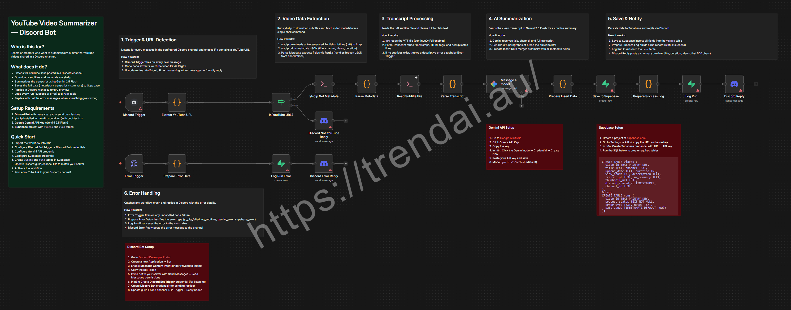

# YouTube Video Summarizer — Discord Bot

> Automatically summarize YouTube videos shared in Discord using yt-dlp, Gemini AI, and Supabase.

> **Self-hosted n8n only.** This workflow uses the Execute Command node to run `yt-dlp` inside the n8n container. This requires shell access, which is only available on self-hosted instances (Docker, VPS, etc.) — it will **not** work on n8n Cloud.

**[Import this workflow into n8n](https://raw.githubusercontent.com/trendai-au-lab/n8n-workflow/main/workflows/youtube-video-summarizer-discord/workflow.json)**

---

## Prerequisites

| Tool | Purpose |
|------|---------|
| **Discord Bot** | Listens for messages and sends replies |
| **yt-dlp** | Downloads subtitles and video metadata (must be installed in the n8n container) |
| **Google Gemini API** | Summarizes video transcripts (Gemini 2.5 Flash) |
| **Supabase** | Stores video data and run logs |

## Credentials

| Node | Credential Type | Notes |
|------|----------------|-------|
| Discord Trigger | Discord Bot Trigger | Bot token with Message Content Intent enabled |
| Discord Reply / Discord Not YouTube Reply / Discord Error Reply | Discord Bot | Same bot, used for sending messages |
| Message a model (Gemini) | Google Gemini (PaLM) API | API key from Google AI Studio |
| Save to Supabase / Log Run / Log Run Error | Supabase | Project URL + anon key |

---

## What It Does

1. **Listens** for messages in a Discord channel via a bot trigger
2. **Detects** YouTube URLs using RegEx (supports youtube.com, youtu.be, shorts, live)
3. **Downloads** subtitles and metadata using yt-dlp
4. **Parses** the VTT subtitle file into clean plain text
5. **Summarizes** the transcript with Gemini 2.5 Flash (3-5 paragraph prose)
6. **Saves** video metadata, transcript, and summary to a Supabase `videos` table
7. **Logs** every run (success or error) to a Supabase `runs` table
8. **Replies** in Discord with the video title, stats, and summary preview

Non-YouTube messages get a friendly "not a YouTube link" reply. Errors are caught by an Error Trigger, classified, logged, and reported back to Discord.

---

## How It Works

### Main Flow (Happy Path)

```
Discord Trigger → Extract YouTube URL → Is YouTube URL?
  ├─ Yes → yt-dlp Get Metadata → Parse Metadata → Read Subtitle File → Parse Transcript
  │        → Message a model (Gemini) → Prepare Insert Data → Save to Supabase
  │        → Prepare Success Log → Log Run → Discord Reply
  └─ No  → Discord Not YouTube Reply
```

### Error Flow

```
Error Trigger → Prepare Error Data → Log Run Error → Discord Error Reply
```

---

## Node Breakdown

| # | Node | Type | Description |
|---|------|------|-------------|
| 1 | Discord Trigger | Discord Bot Trigger | Fires on every message in the configured channel |
| 2 | Extract YouTube URL | Code | RegEx extracts video ID from message content |
| 3 | Is YouTube URL? | IF | Routes YouTube URLs to processing, others to rejection reply |
| 4 | yt-dlp Get Metadata | Execute Command | Downloads subtitles (.vtt) and prints metadata JSON |
| 5 | Parse Metadata | Code | Extracts title, channel, views, duration via RegEx |
| 6 | Read Subtitle File | Execute Command | Reads the .vtt file (continueOnFail enabled) |
| 7 | Parse Transcript | Code | Strips VTT timestamps/tags, deduplicates lines |
| 8 | Message a model | Google Gemini | Sends transcript to Gemini 2.5 Flash for summarization |
| 9 | Prepare Insert Data | Code | Merges summary with all metadata fields |
| 10 | Save to Supabase | Supabase | Inserts full record into `videos` table |
| 11 | Prepare Success Log | Code | Builds success run record |
| 12 | Log Run | Supabase | Inserts into `runs` table |
| 13 | Discord Reply | Discord | Posts summary preview to channel |
| 14 | Discord Not YouTube Reply | Discord | Replies when message isn't a YouTube link |
| 15 | Error Trigger | Error Trigger | Catches any unhandled node failure |
| 16 | Prepare Error Data | Code | Classifies error type and extracts context |
| 17 | Log Run Error | Supabase | Logs error to `runs` table |
| 18 | Discord Error Reply | Discord | Posts error message to channel |

---

## Setup Guide

### 1. Discord Bot

1. Go to the [Discord Developer Portal](https://discord.com/developers/applications)
2. Create a new Application → Bot
3. Enable **Message Content Intent** under Privileged Intents
4. Copy the Bot Token
5. Invite the bot to your server with **Send Messages** + **Read Messages** permissions
6. In n8n, create a **Discord Bot Trigger** credential (for listening) and a **Discord Bot** credential (for sending replies)
7. Update the guild ID and channel ID in the Discord Trigger node and all Discord reply nodes

### 2. yt-dlp

yt-dlp must be installed in your n8n container. For Docker-based installs:

```bash
docker exec -it n8n apk add --no-cache python3 py3-pip
docker exec -it n8n pip3 install yt-dlp
```

Optional: Place a `cookies.txt` file at `/home/node/.n8n/cookies.txt` to avoid age-gated or bot-detection issues.

### 3. Google Gemini API

1. Go to [Google AI Studio](https://aistudio.google.com/apikey)
2. Click **Create API Key** and copy it
3. In n8n, click the Gemini node → Credential → Create New
4. Paste your API key and save

### 4. Supabase

1. Create a project at [supabase.com](https://supabase.com)
2. Go to **Settings → API** and copy the **URL** and **anon key**
3. In n8n, create a Supabase credential with your URL and API key
4. Run the SQL below in the Supabase SQL Editor to create the required tables

---

## Supabase SQL

```sql
-- Videos table: stores video metadata, transcript, and AI summary
CREATE TABLE videos (
  video_id TEXT PRIMARY KEY,
  title TEXT,
  channel TEXT,
  upload_date TEXT,
  duration INT,
  view_count INT,
  description TEXT,
  transcript TEXT,
  ai_summary TEXT,
  thumbnail_url TEXT,
  discord_shared_at TIMESTAMPTZ,
  channel_id TEXT
);

-- Runs table: logs every workflow execution (success or error)
CREATE TABLE runs (
  video_id TEXT PRIMARY KEY,
  process_status TEXT NOT NULL,
  error_type TEXT,
  notes TEXT,
  date_added TIMESTAMPTZ DEFAULT now()
);
```
